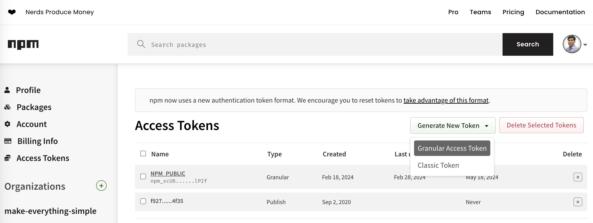
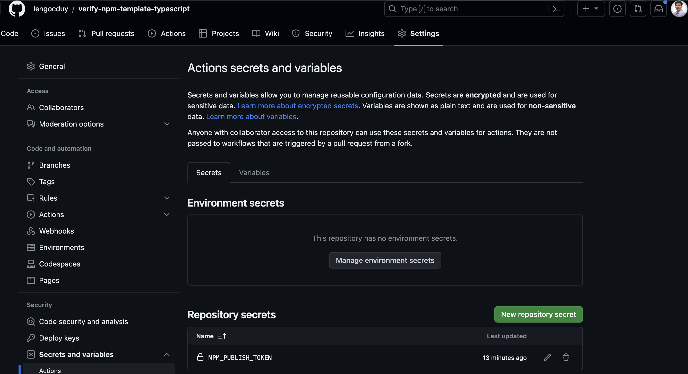
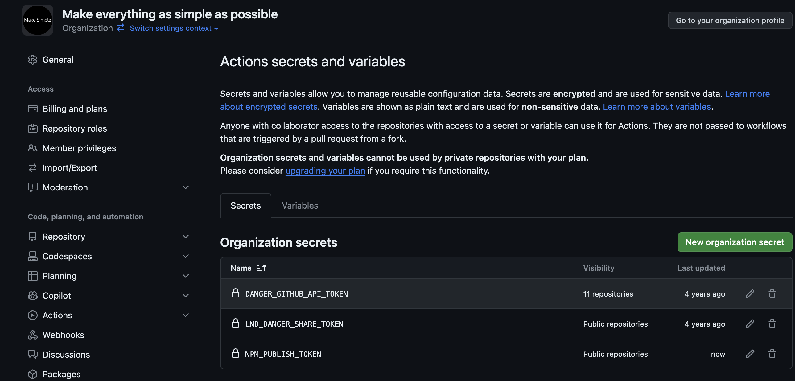
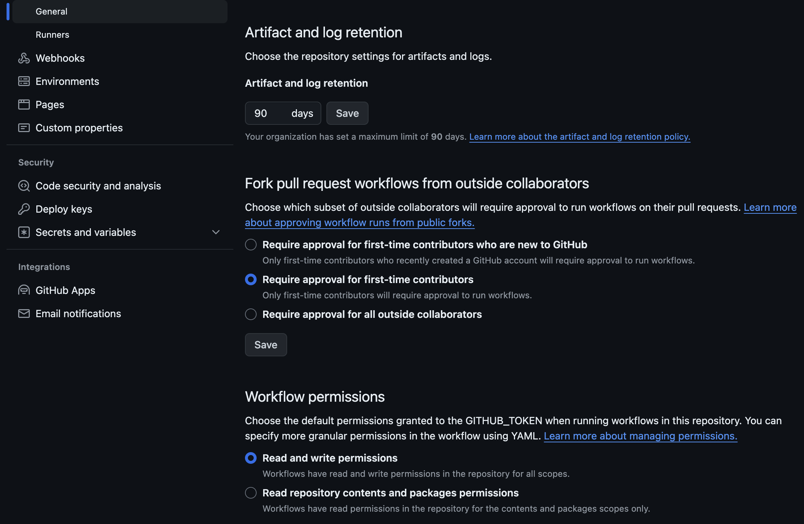

# Configure necessary credentials once you are ready for release

1. Generate a Granular Access Token on [npmjs.com](https://www.npmjs.com/) 
2. Configure in your repository's secret variables
    1. Individual level 
    2. Organization level to share across repositories on-demand 
3. Grant `Read and write permissions` to allow Github Actions publish | update github package 
